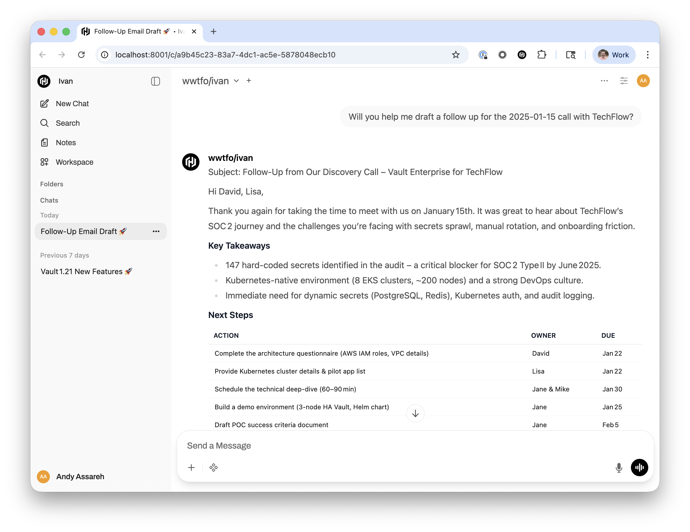

# Ivan 🤖

An intelligent assistant designed to optimize solutions engineering workflows.

<!-- Screenshot: follow-up email draft -->


_Figure: Follow-up email draft generated by Ivan (screenshot)._ 

## Why Ivan?

<table>
<tr>
<td align="center" width="25%">
  <h3>🔒 Fully Private</h3>
  <p>Runs entirely on your machine or private infrastructure. No data leaves your environment — ever.</p>
</td>
<td align="center" width="25%">
  <h3>🧩 Browser Extension</h3>
  <p>Chrome extension for seamless Salesforce integration and automated form completion.</p>
</td>
<td align="center" width="25%">
  <h3>🛠️ Built-in Tools + Notes Intelligence</h3>
  <p>Understands what day it is, can search your notes & customer data wherever they are — no more copy/paste.</p>
</td>
<td align="center" width="25%">
  <h3>💬 Chat History & Threads</h3>
  <p>Complete conversation history with thread organization.</p>
</td>
</tr>
<tr>
<td align="center" width="25%">
  <h3>🔌 OpenAI Compatible</h3>
  <p>Drop-in API compatibility with existing OpenAI workflows, clients, and integrations.</p>
</td>
<td align="center" width="25%">
  <h3>🎯 Multiple Backends</h3>
  <p>Works with Ollama or LM Studio — use any local LLM you prefer.</p>
</td>
<td align="center" width="25%">
  <h3>🏗️ HashiCorp Expert Mode</h3>
  <p>Deep knowledge of Terraform, Vault, Consul, Nomad — including product docs, guides, and best-practice architecture examples.</p>
</td>
<td align="center" width="25%">
  <h3>✨ Smart Suggestions</h3>
  <p>AI-powered contextual suggestions and auto-completion for faster workflows.</p>
</td>
</tr>
</table>

## Development Roadmap

See the `roadmap/` directory for project planning and improvement documentation:
- **ISSUES.md** - Known issues and planned fixes
- **SEARCH_ALTERNATIVES.md** - Search implementation research and alternatives
- **CODEBASE_ANALYSIS.md** - Detailed codebase structure analysis
- **CODE_REVIEW_SUMMARY.md** - Code review findings and recommendations

This directory tracks ongoing improvements, technical decisions, and future enhancements.

## Chrome Extension

Ivan includes a Chrome extension for automating SE Weekly Updates and WARMER with AI assistance, all directly from within your browser.


### Features

- **Quick Actions**: One-click SE Weekly Update completion, One-click WARMER completion
- **Smart Context**: Automatically extracts opportunity title and user initials from the page, searches your customer notes, and retrieves relevant information
- **Chat Interface**: Conversational refinement of updates before committing
- **Auto-Fill**: Inserts completed updates directly into Salesforce fields

### Installation

1. Navigate to `chrome://extensions` in Chrome
2. Enable "Developer mode"
3. Click "Load unpacked" and select the `ivan-extension` directory
4. Configure the extension to point to your Ivan instance (default: `http://localhost:8000`)

### Usage

1. In Vivun, on the Journeys page, click on an opportunity
2. Click the Ivan extension icon
3. Optionally add additional context in the text input field
4. Click "Complete SE Weekly Update" or "Complete WARMER"
5. Review and refine the generated content through chat
6. Click "Commit" to insert the update into the field

## Quick Start

### Installation

**Prerequisites:**
- [pyenv](https://github.com/pyenv/pyenv) (for Python version management)
  - macOS: `brew install pyenv`
  - Linux: `curl https://pyenv.run | bash`

**Setup:**
```bash
# Clone or navigate to the project directory
cd Ivan

# Run the setup script (handles everything)
./setup.sh

# Activate the virtual environment
source venv/bin/activate
```

**What the setup script does:**
- Verifies/installs Python 3.12.0 via pyenv
- Creates a virtual environment with the correct Python version
- Installs all dependencies including Open Web UI
- Applies HashiCorp branding automatically
- Ensures compatibility across different systems

### Running Ivan

**Basic usage (default: LM Studio):**
```bash
python ivan.py
# Uses LM Studio backend by default with model: openai/gpt-oss-20b
```

**With Ollama:**
```bash
python ivan.py --backend ollama --model openai/gpt-oss-20b
# Or set via environment variable: export IVAN_BACKEND=ollama
```

**With LM Studio (custom model):**
```bash
python ivan.py --backend lmstudio --model your-model-name
```

**Without Web UI:**
```bash
python ivan.py --no-webui
```

**Custom port:**
```bash
python ivan.py --port 8080
```

**Force rebuild documentation index:**
```bash
python ivan.py --rebuild-index
```

**Force complete re-scrape (re-downloads all pages):**
```bash
python ivan.py --force-scrape
```

### First Run: Automatic Index Building

**On first use**, Ivan will automatically build a searchable index of HashiCorp documentation. This is a one-time setup process that:

- **Downloads the sitemap** from developer.hashicorp.com
- **Crawls documentation pages** from all HashiCorp products
- **Builds a semantic search index** using LangChain FAISS for fast, accurate retrieval
- **Caches the index** in `hashicorp_web_docs/` for instant subsequent searches

The index build process:
- Runs **automatically when Ivan starts** if needed (first run or after 7 days)
- Takes approximately **15-30 minutes** on first build (with --force-scrape)
- Takes approximately **5-10 minutes** for rebuilds (with --rebuild-index, uses cached pages)
- Shows **detailed progress** in the terminal with real-time ETA and statistics
- Is **cached for 7 days** - after that, Ivan rebuilds automatically on next startup

**Manual rebuild options:**
- `python ivan.py --rebuild-index` - Fast rebuild using cached page HTML (~5-10 min)
- `python ivan.py --force-scrape` - Complete re-scrape of all pages (~20-30 min)

**Note**: The index must complete building before you can search HashiCorp documentation. All progress is shown in the terminal as Ivan starts.

**Note**: You can use all other Ivan features (customer notes, general chat, etc.) immediately - only HashiCorp documentation search requires the index.

### Configuration

Ivan can be configured in three ways (listed from highest to lowest priority):

#### 1. Command Line Options (Highest Priority)

Override settings for a single session:

```bash
# Use Ollama with a specific model
python ivan.py --backend ollama --model openai/gpt-oss-20b

# Use LM Studio with custom port
python ivan.py --backend lmstudio --model openai/gpt-oss-20b --port 8080

# Combine multiple options
python ivan.py --backend ollama --model openai/gpt-oss-20b --no-webui --debug
```

#### 2. Environment Variables (Medium Priority)

Set persistent configuration via `.env` file or shell environment:

```bash
# Backend configuration
export IVAN_BACKEND=ollama          # or lmstudio
export BACKEND_MODEL=openai/gpt-oss-20b       # your model name
export OLLAMA_ENDPOINT=http://localhost:11434
export LMSTUDIO_ENDPOINT=http://localhost:1234/v1

# Ivan settings
export IVAN_PORT=8000
export IVAN_TEMPERATURE=0.0
export SYSTEM_PROMPT_PATH=system_prompt.md
export CUSTOMER_NOTES_DIR=Customer_Notes  # Path to customer meeting notes
```

**Using a .env file:**
1. Create `.env` in the Ivan directory (use `.env.example` as a template)
2. Add your settings: `IVAN_BACKEND=ollama`
3. Settings are automatically loaded when Ivan starts

#### 3. Configuration File (Lowest Priority)

Edit `config.py` directly for permanent defaults:

```python
# config.py
BACKEND_TYPE = "ollama"  # or "lmstudio"
BACKEND_MODEL = "openai/gpt-oss-20b"
DEFAULT_PORT = 8000
```

**Note:** The setup script automatically creates `config.py` from `config.py.example` on first run. This file is not tracked in version control, so you can modify defaults without git conflicts.

#### Context Length Settings

**Important: Set your context length to the maximum supported by your model** for best results. Ivan uses tools and can have long conversations with substantial context, so a larger context window ensures better performance.

**Recommended settings:**
- **For gpt-oss-20b**: Set context length to **131072** (128K tokens)
- **For other models**: Set to the maximum supported by your specific model

**How to configure:**
- **LM Studio**: In the model settings, find "Context Length" or "Max Context" and set it to your model's maximum (e.g., 131072)
- **Ollama**: Configure in your Modelfile with the `num_ctx` parameter:
  ```
  PARAMETER num_ctx 131072
  ```

**Why it matters:**
- Enables longer conversations without losing context
- Supports complex tool calling sequences
- Allows Ivan to reference more of your customer notes and documentation
- Prevents context window truncation during extended sessions

#### Temperature Settings

**Recommended: Set temperature to 0.0 in your LLM backend (Ollama or LM Studio)** for the most deterministic, fact-based responses. This is especially important for:
- Technical documentation queries
- SE Weekly Updates (consistency and accuracy)
- WARMER assessments (precise documentation)
- Customer follow-ups (factual communication)

**Note**: You can experiment with slightly higher temperatures (e.g., 0.1-0.3) if you want more creative or varied responses, but start with 0.0 for best results with structured workflows.

**How to configure:**
- **Ollama**: Set temperature in your Modelfile or via API parameters
- **LM Studio**: Configure temperature in the model settings UI (recommended) or via API
- **Ivan's IVAN_TEMPERATURE**: This sets the default for API requests, but backend settings take precedence

#### Reasoning Level Settings

Some models support different reasoning levels that affect how deeply the model thinks through problems before responding. **For gpt-oss-20b**, you can choose between:

- **Low** - Faster responses with basic reasoning
- **Medium** - Balanced reasoning and speed (recommended starting point)
- **High** - Deeper reasoning for complex problems (slower but more thorough)

**How to configure:**
- **LM Studio**: In the model settings, look for "Reasoning Level" or similar parameter
- **Ollama**: Configure in your Modelfile with model-specific parameters (consult model documentation)

**When to experiment with reasoning levels:**
- **Low**: Quick queries, simple lookups, straightforward documentation searches
- **Medium**: Most SE workflows, meeting summaries, standard technical questions
- **High**: Complex architectural decisions, multi-step problem solving, detailed analysis

**Note**: Not all models support reasoning levels. Check your specific model's documentation for availability and configuration options.

## HashiCorp Branding

Ivan includes HashiCorp branding for the Open Web UI interface. This is applied automatically during the initial setup (`./setup.sh`).

**What gets branded:**
- **HashiCorp logos and favicons** throughout the UI
- **"Ivan" name** replaces all "Open WebUI" text
- **Splash screen** with HashiCorp logo during page loads

The branding assets are stored in the `branding/` directory and can be customized as needed.

**Note**: If you manually upgrade Open Web UI, you can reapply branding with:
```bash
./apply_branding.sh
```

## Usage

### With Open Web UI

1. Start Ivan: `python ivan.py`
2. Open Web UI will automatically start on port 8001 (or port + 1)
3. Access the Web UI at `http://localhost:8001`

**First-time setup:**

On your first visit, you'll see a HashiCorp-branded onboarding splash screen with phrases like "Accelerate innovation with Ivan AI" rotating in the background.

1. Click "Get started" to proceed
2. **Create a local admin account** by entering:
   - Your name
   - Email address
   - Password (and confirmation)
3. Click "Create Admin Account"

**Important:** This account is stored locally on your machine only - it's just for accessing the Open Web UI interface and is not connected to any external service.

Once logged in, the Web UI is pre-configured to use Ivan at `http://localhost:8000/v1` - no additional configuration needed!

### With API Clients

Ivan provides an OpenAI-compatible API:

```python
import openai

client = openai.OpenAI(
    base_url="http://localhost:8000/v1",
    api_key="not-needed"
)

response = client.chat.completions.create(
    model="wwtfo/ivan",
    messages=[
        {"role": "user", "content": "What's the current date?"}
    ]
)

print(response.choices[0].message.content)
```

### With curl

```bash
curl http://localhost:8000/v1/chat/completions \
  -H "Content-Type: application/json" \
  -d '{
    "model": "wwtfo/ivan",
    "messages": [{"role": "user", "content": "What day is it?"}],
    "temperature": 0
  }'
```

## Tools

Ivan comes with built-in tools:

### 1. Current Date Tool
Get the current date and time in any format.

**Example**: "What's today's date?" or "What's the current time?"

### 2. Customer Notes Search Tool
Search through customer meeting notes organized in a hierarchical directory structure.

**Setup**: Create a symbolic link to your customer notes:
```bash
ln -s /path/to/your/Customer_Notes ./Customer_Notes
```

Or set the `CUSTOMER_NOTES_DIR` environment variable to point to your notes location.

**Expected Structure**:
```
Customer_Notes/
├── 0-9/
├── A/
│   └── Adobe/
│       └── 10_Meetings/
│           └── 2025-01-15_Discovery_Call.md
├── B/
└── ...
```

**Smart Name Matching**:
- Automatically converts spaces to underscores
- Supports abbreviations via `CUSTOMER_ALIASES` in `config.py`
- Case-insensitive substring matching

**Example**: "Show me recent Adobe meetings"

### 3. Read Customer Note Tool
Read the full content of a specific customer meeting note.

**Example**: Used automatically after searching to get full meeting details

## Customization

### System Prompt

Edit `system_prompt.md` to customize Ivan's behavior. The file is automatically cached and reloaded when modified.

### Adding Tools

Add new tools in `tools.py`:

```python
from langchain.tools import Tool
from langchain.pydantic_v1 import BaseModel, Field

class MyToolInput(BaseModel):
    param: str = Field(description="Parameter description")

def my_tool_function(param: str) -> str:
    # Your tool logic here
    return f"Result: {param}"

my_tool = Tool(
    name="my_tool",
    description="Description of what the tool does",
    func=my_tool_function,
    args_schema=MyToolInput
)

# Add to ALL_TOOLS list
ALL_TOOLS.append(my_tool)
```

## API Endpoints

- `GET /health` - Health check
- `GET /v1/models` - List available models
- `POST /v1/chat/completions` - Chat completion endpoint

## CLI Options

```bash
python ivan.py --help

Options:
  --port INTEGER                 Port to run Ivan on (default: 8000)
  --backend [ollama|lmstudio]   Backend to use (default: ollama)
  --model TEXT                   Model name to use with backend
  --no-webui                     Don't start Open Web UI
  --debug                        Run in debug mode
  --help                         Show this message and exit
```

## Requirements

- **Python 3.8+** for Ivan core functionality
- **Python 3.11-3.12** for Open Web UI integration (optional)
  - If you have Python 3.14+, use `--no-webui` flag or set up a separate Python 3.11/3.12 environment
- Ollama or LM Studio running locally
- A compatible model loaded in your backend

### Python Version Setup

**If you need Python 3.11/3.12 for Web UI:**

Using pyenv:
```bash
# Install pyenv if you don't have it
brew install pyenv

# Install Python 3.12
pyenv install 3.12.0

# Create virtual environment with Python 3.12
pyenv local 3.12.0
python -m venv venv
source venv/bin/activate
pip install -r requirements.txt
pip install open-webui
```

**If using Python 3.14+ (without Web UI):**
```bash
python3 -m venv venv
source venv/bin/activate
pip install -r requirements.txt
# Run with: python ivan.py --no-webui
```

## Architecture

```
Ivan
├── ivan.py           # Main Flask application
├── config.py         # Configuration management
├── tools.py          # Tool definitions
├── system_prompt.md  # System prompt (customizable)
├── Customer_Notes/   # Symlink to customer meeting notes (optional)
└── requirements.txt  # Python dependencies
```

## Troubleshooting

**Ivan can't connect to Ollama/LM Studio:**
- Ensure your backend is running
- Check the endpoint configuration matches your backend
- Verify the model name is correct

**Tools not working:**
- Ensure your system prompt allows tool usage
- Verify the backend model supports function calling
- For customer notes: check that the Customer_Notes symlink or directory exists

**Open Web UI not starting:**
- Install it manually: `pip install open-webui`
- Or run with `--no-webui` and start it separately

## License

MIT

## Contributing

Contributions welcome! Feel free to open issues or submit pull requests.
