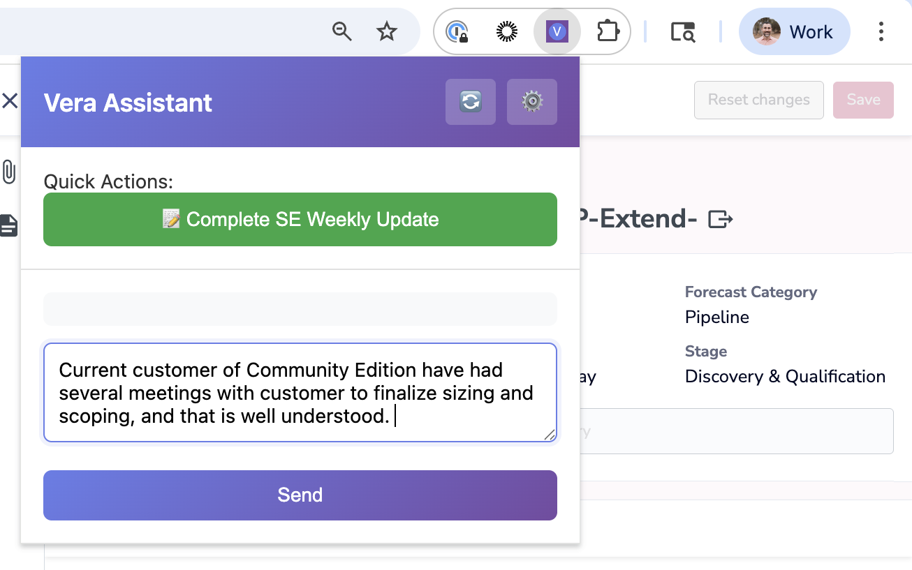

# Ivan 🤖

A Flask-based chatbot application with tool calling capabilities, providing an OpenAI-compatible API for local LLM backends.

## Features

- 🔧 **Tool Calling**: Built-in tools for current date/time and customer meeting notes search
- 🔌 **OpenAI-Compatible API**: Works with any OpenAI-compatible client
- 🎯 **Multiple Backends**: Supports both Ollama and LM Studio
- 📝 **Smart Caching**: Efficient system prompt caching based on file modification time
- 🌐 **Optional Web UI**: Integrated Open Web UI for easy interaction
- 🧩 **Chrome Extension**: Browser extension for SE Weekly Updates automation
- ⚙️ **Configurable**: Flexible CLI and environment variable configuration

## Chrome Extension

Ivan includes a Chrome extension for automating SE Weekly Updates with AI assistance.



### Features

- **Quick Actions**: One-click SE Weekly Update completion
- **Smart Context**: Automatically extracts opportunity title and user initials from the page
- **Chat Interface**: Conversational refinement of updates before committing
- **Auto-Fill**: Inserts completed updates directly into Salesforce fields

### Installation

1. Navigate to `chrome://extensions` in Chrome
2. Enable "Developer mode"
3. Click "Load unpacked" and select the `ivan-extension` directory
4. Configure the extension to point to your Ivan instance (default: `http://localhost:8000`)

### Usage

1. Open a Salesforce opportunity with an SE Weekly Update field
2. Click the Ivan extension icon
3. Click "Complete SE Weekly Update" to generate an update
4. Review and refine the generated content through chat
5. Click "Commit" to insert the update into the field

## Quick Start

### Installation

```bash
# Clone or navigate to the project directory
cd Ivan

# Install dependencies
pip install -r requirements.txt
```

### Running Ivan

**Basic usage (with Ollama):**
```bash
python ivan.py
```

**With LM Studio:**
```bash
python ivan.py --backend lmstudio --model your-model-name
```

**Without Web UI:**
```bash
python ivan.py --no-webui
```

**Custom port:**
```bash
python ivan.py --port 8080
```

### Configuration

Ivan can be configured via environment variables:

```bash
# Backend configuration
export IVAN_BACKEND=ollama          # or lmstudio
export BACKEND_MODEL=llama3.2       # your model name
export OLLAMA_ENDPOINT=http://localhost:11434
export LMSTUDIO_ENDPOINT=http://localhost:1234/v1

# Ivan settings
export IVAN_PORT=8000
export IVAN_TEMPERATURE=0.0
export SYSTEM_PROMPT_PATH=system_prompt.md
export NOTES_DIR=notes
export CUSTOMER_NOTES_DIR=Customer_Notes  # Path to customer meeting notes
```

## Usage

### With Open Web UI

1. Start Ivan: `python ivan.py`
2. Open Web UI will automatically start on port 8001 (or port + 1)
3. Access the Web UI at `http://localhost:8001`
4. Configure Open Web UI to use Ivan at `http://localhost:8000/v1`

### With API Clients

Ivan provides an OpenAI-compatible API:

```python
import openai

client = openai.OpenAI(
    base_url="http://localhost:8000/v1",
    api_key="not-needed"
)

response = client.chat.completions.create(
    model="wwtfo/ivan",
    messages=[
        {"role": "user", "content": "What's the current date?"}
    ]
)

print(response.choices[0].message.content)
```

### With curl

```bash
curl http://localhost:8000/v1/chat/completions \
  -H "Content-Type: application/json" \
  -d '{
    "model": "wwtfo/ivan",
    "messages": [{"role": "user", "content": "What day is it?"}],
    "temperature": 0
  }'
```

## Tools

Ivan comes with built-in tools:

### 1. Current Date Tool
Get the current date and time in any format.

**Example**: "What's today's date?" or "What's the current time?"

### 2. Customer Notes Search Tool
Search through customer meeting notes organized in a hierarchical directory structure.

**Setup**: Create a symbolic link to your customer notes:
```bash
ln -s /path/to/your/Customer_Notes ./Customer_Notes
```

Or set the `CUSTOMER_NOTES_DIR` environment variable to point to your notes location.

**Expected Structure**:
```
Customer_Notes/
├── 0-9/
├── A/
│   └── Adobe/
│       └── 10_Meetings/
│           └── 2025-01-15_Discovery_Call.md
├── B/
└── ...
```

**Smart Name Matching**:
- Automatically converts spaces to underscores
- Supports abbreviations via `CUSTOMER_ALIASES` in `config.py`
- Case-insensitive substring matching

**Example**: "Show me recent Adobe meetings"

### 3. Read Customer Note Tool
Read the full content of a specific customer meeting note.

**Example**: Used automatically after searching to get full meeting details

## Customization

### System Prompt

Edit `system_prompt.md` to customize Ivan's behavior. The file is automatically cached and reloaded when modified.

### Adding Tools

Add new tools in `tools.py`:

```python
from langchain.tools import Tool
from langchain.pydantic_v1 import BaseModel, Field

class MyToolInput(BaseModel):
    param: str = Field(description="Parameter description")

def my_tool_function(param: str) -> str:
    # Your tool logic here
    return f"Result: {param}"

my_tool = Tool(
    name="my_tool",
    description="Description of what the tool does",
    func=my_tool_function,
    args_schema=MyToolInput
)

# Add to ALL_TOOLS list
ALL_TOOLS.append(my_tool)
```

## API Endpoints

- `GET /health` - Health check
- `GET /v1/models` - List available models
- `POST /v1/chat/completions` - Chat completion endpoint

## CLI Options

```bash
python ivan.py --help

Options:
  --port INTEGER                 Port to run Ivan on (default: 8000)
  --backend [ollama|lmstudio]   Backend to use (default: ollama)
  --model TEXT                   Model name to use with backend
  --no-webui                     Don't start Open Web UI
  --debug                        Run in debug mode
  --help                         Show this message and exit
```

## Requirements

- **Python 3.8+** for Ivan core functionality
- **Python 3.11-3.12** for Open Web UI integration (optional)
  - If you have Python 3.14+, use `--no-webui` flag or set up a separate Python 3.11/3.12 environment
- Ollama or LM Studio running locally
- A compatible model loaded in your backend

### Python Version Setup

**If you need Python 3.11/3.12 for Web UI:**

Using pyenv:
```bash
# Install pyenv if you don't have it
brew install pyenv

# Install Python 3.12
pyenv install 3.12.0

# Create virtual environment with Python 3.12
pyenv local 3.12.0
python -m venv venv
source venv/bin/activate
pip install -r requirements.txt
pip install open-webui
```

**If using Python 3.14+ (without Web UI):**
```bash
python3 -m venv venv
source venv/bin/activate
pip install -r requirements.txt
# Run with: python ivan.py --no-webui
```

## Architecture

```
Ivan
├── ivan.py           # Main Flask application
├── config.py         # Configuration management
├── tools.py          # Tool definitions
├── system_prompt.md  # System prompt (customizable)
├── Customer_Notes/   # Symlink to customer meeting notes (optional)
└── requirements.txt  # Python dependencies
```

## Troubleshooting

**Ivan can't connect to Ollama/LM Studio:**
- Ensure your backend is running
- Check the endpoint configuration matches your backend
- Verify the model name is correct

**Tools not working:**
- Ensure your system prompt allows tool usage
- Verify the backend model supports function calling
- For customer notes: check that the Customer_Notes symlink or directory exists

**Open Web UI not starting:**
- Install it manually: `pip install open-webui`
- Or run with `--no-webui` and start it separately

## License

MIT

## Contributing

Contributions welcome! Feel free to open issues or submit pull requests.
